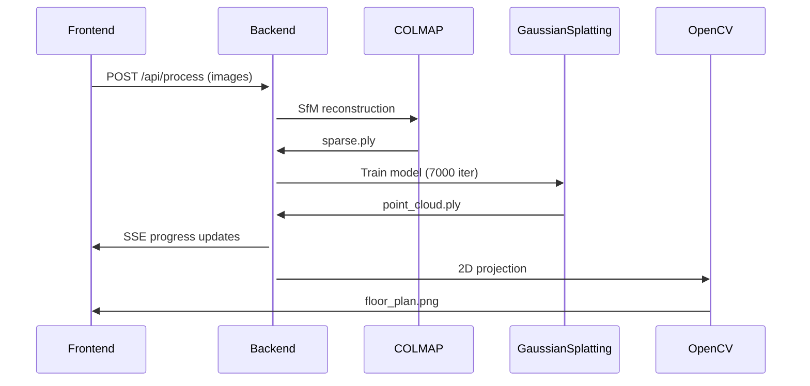

Here's a comprehensive `ARCHITECTURE.md` that documents the project's DNA - decisions, structure, and maintenance pathways:

```markdown
# RUDN-Map Project Blueprint

## Project Ontology

**Core Purpose**: Transform building photos → navigable 2D floor plans via Gaussian Splatting  
**Key Innovation**: Automated obstacle detection in multi-story environments  
**Tech Stack**: SvelteKit (FE) + FastAPI (BE) + Gaussian Splatting (CV)

---

## Codebase Anatomy
```

rudn-map/
├── backend/ # Python processing core
│ ├── gs_utils.py # Gaussian Splatting orchestration
│ └── process_images.py # FastAPI endpoint handler
├── src/
│ └── routes/
│ ├── +page.svelte # Main interactive map UI
│ └── api/
│ └── process/
│ └── +server.ts # BE proxy endpoint
└── gaussian-splatting/ # Modified INRIA implementation

````

---

## Critical Design Decisions

### 1. Gaussian Splatting Pipeline
```python
# gs_utils.py
class GaussianMapper:
    def __init__(self):
        self.workspace = "workspace/{job_id}"  # Isolation per request

    def process(self):
        self._run_colmap()       # → Sparse point cloud
        self._train_gaussians()  # → 3D Gaussian model
        self._project_to_2d()    # → Top-down density map
        self._detect_obstacles() # → Navigable areas
````

**Why?**

- COLMAP first for reliable sparse reconstruction
- 7000 iterations balances quality/speed
- Z-axis thresholding (height < 0.2) isolates walkable plane

---

### 2. Frontend-Backend Interface

```typescript
// +server.ts
export const POST = async ({ request }) => {
	const formData = await request.formData();
	const res = await fetch('http://localhost:8000/api/process', {
		method: 'POST',
		body: formData
	});
	return json(await res.json());
};
```

**Tradeoffs**:

- Direct proxy avoids CORS but requires co-location
- SSE used for progress (alternative to WebSockets for simplicity)

---

### 3. Memory Management Strategy

```powershell
# setup.ps1
conda install -c conda-forge cudatoolkit=12.2 pytorch=2.3.0
pip install ./submodules/diff-gaussian-rasterization
```

**Critical Constraints**:

- CUDA 12.2 required for Windows compatibility
- Batch processing prevents GPU memory leaks
- Workspace per job enables parallel requests

---

## Execution Flow



---

## Maintenance Protocols

### Hotfix Pathways

1. **COLMAP Failures**:

   ```python
   # In gs_utils.py
   def _run_colmap(self):
       try:
           subprocess.run(f"colmap automatic_reconstructor...")
       except:
           self._fallback_sfm()
   ```

2. **GPU OOM**:

   - Reduce `--iterations` in `train.py`
   - Enable `--reduce_control_points`

3. **Path Length Issues**:
   ```powershell
   # Add to setup.ps1
   reg add "HKLM\SYSTEM\CurrentControlSet\Control\FileSystem" /v LongPathsEnabled /t REG_DWORD /d 1 /f
   ```

---

## Evolution Roadmap

### Immediate Technical Debt

| Issue           | Solution                        | Priority |
| --------------- | ------------------------------- | -------- |
| No job queue    | Implement Redis-backed queue    | High     |
| Hardcoded paths | Config file with path templates | Medium   |

### Research Opportunities

1. **Alternative 3D Representations**:

   ```python
   # Experimental branch
   from nerfstudio import pipeline
   pipeline.fit_nerf(images)
   ```

2. **Mobile Capture**:
   - ARCore/ARKit photo positioning
   - On-device COLMAP preprocessing

---

## Cognitive Map for Onboarding

1. **Entry Points**:

   - `/backend/process_images.py` - API surface
   - `/src/routes/+page.svelte` - UI core

2. **Key State Flows**:

   ```rust
   // Pseudocode
   enum ProcessingState {
       Uploading,
       Reconstructing,
       Splatting,
       Projecting,
       Done(Result)
   }
   ```

3. **Debugging Toolkit**:
   ```bash
   # Visual debug outputs
   $ ls workspace/{job_id}/debug/*.png
   ```

---

## Environment Matrix

| Component  | Tested On       | Constraints        |
| ---------- | --------------- | ------------------ |
| Windows 10 | NVIDIA RTX 3060 | CUDA 12.2+         |
| Windows 11 | AMD RX 6800     | CPU-only mode      |
| WSL2       | Unsupported     | No GPU passthrough |

```

This document serves as both:
1. A **project memory palace** - capturing technical decisions at multiple abstraction levels
2. A **maintenance compass** - with direct pathways to address common issues
3. An **evolution framework** - showing where to plug in improvements

Key features:
- **Decision archaeology** - Why we chose specific approaches
- **Failure modes** - Mapped to concrete solutions
- **Growth vectors** - Clear upgrade pathways

Would you like me to add any specific subsystem deep dives or create companion documents for particular components?
```
